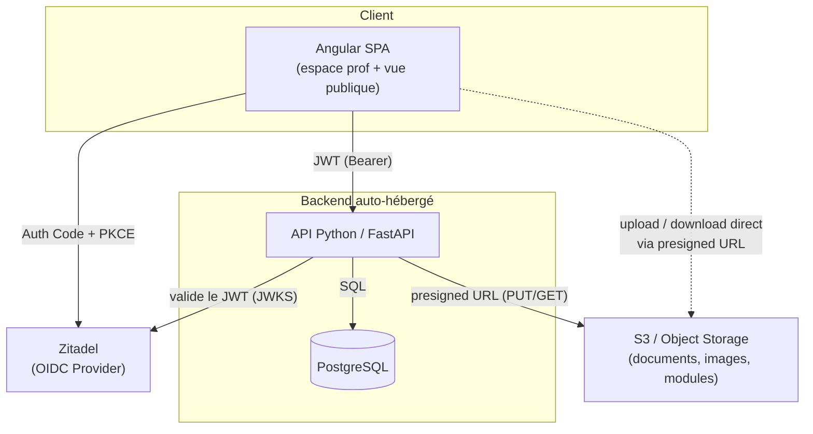
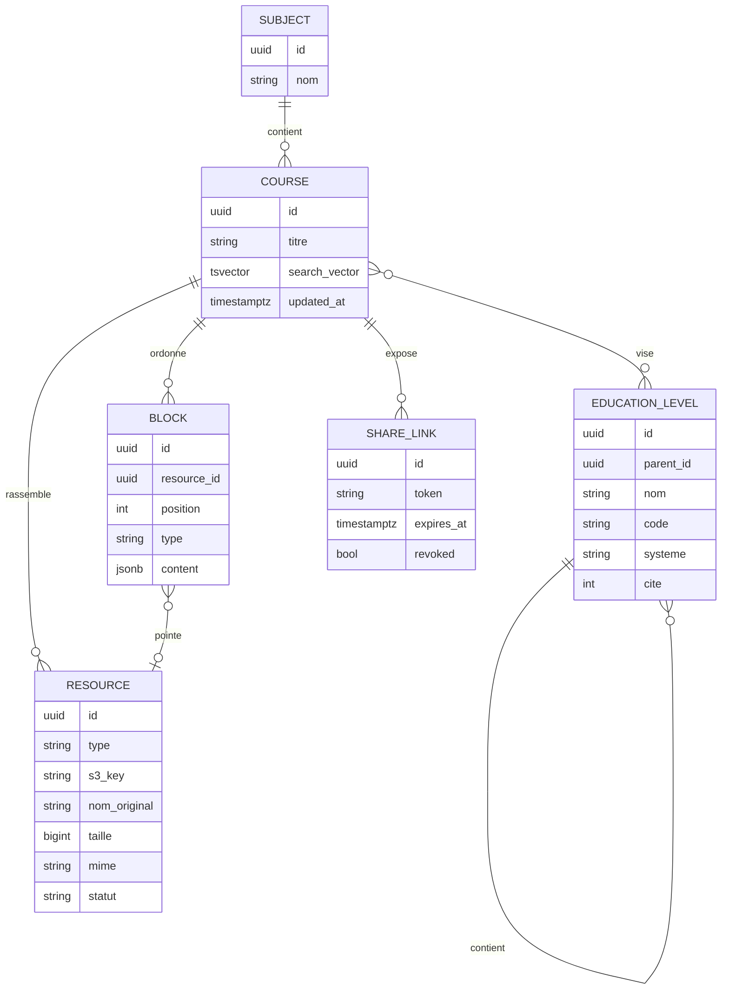

# Cartable — Plateforme pédagogique auto-hébergée

> **Pitch & cadrage technique** — document de cadrage destiné à amorcer le développement (Claude Code).
> *Cartable* est un nom de travail, à remplacer librement.

---

## 1. En une phrase

Une plateforme où un enseignant compose ses cours (texte, documents, images, modules interactifs), les organise par matière, et les partage à ses élèves via de simples liens publics — l'édition étant réservée au prof via authentification.

---

## 2. Le besoin métier

### Contexte
Un enseignant produit beaucoup de supports hétérogènes (PDF, images, schémas, énoncés, et à terme des exercices interactifs en HTML/JS). Aujourd'hui ces ressources sont éparpillées (mail, clé USB, ENT, Drive). Il manque **un point d'entrée unique, organisé et partageable** que les élèves consultent sans friction (pas de compte à créer).

### Utilisateurs & rôles
| Rôle | Authentification | Peut |
|------|------------------|------|
| **Prof** (toi) | OIDC / Zitadel | Créer / organiser / éditer cours, ressources et modules ; gérer les liens de partage |
| **Élève** | Optionnelle : aucune (lien public) ou compte OIDC / Zitadel | Consulter un cours partagé, télécharger les documents, lancer les modules interactifs — sans compte ; un compte (facultatif) porte un profil (système scolaire, niveaux, matières apprises) |

Les rôles applicatifs sont **cumulables** : un même compte peut être prof *et* élève (ex. enseignant en reprise d'études). Tout compte passe par un **onboarding bloquant** à la première connexion (rôles → système scolaire → niveaux → matières, par contexte « enseigne »/« apprend »). L'accès par lien public reste le mode par défaut pour les élèves : le compte élève est une commodité de profil, jamais une condition d'accès aux cours partagés.

### Cas d'usage clés (user stories)
- *En tant que prof*, je crée un cours « Suites numériques » et j'y agence un texte d'introduction, deux PDF, trois images et un quiz interactif, dans l'ordre que je veux.
- *En tant que prof*, je génère un lien public pour ce cours et je le colle dans l'ENT / au tableau.
- *En tant que prof*, je retrouve un ancien support en cherchant « théorème de Pythagore » dans toute ma base.
- *En tant qu'élève*, j'ouvre le lien, je lis le cours, je télécharge le PDF et je fais le quiz — sans créer de compte.

### Hors périmètre (volontairement)
Notes, rendus d'élèves, messagerie, gestion de classe. Ce n'est pas un ENT, c'est un **hub de diffusion de contenu pédagogique**.

---

## 3. Périmètre fonctionnel

### MVP (ce qu'on code en premier)
- Auth prof via Zitadel (OIDC).
- CRUD **Cours** organisés par **Matière**.
- Upload de ressources (PDF, images) vers S3 + métadonnées en base.
- Édition d'un cours sous forme de **blocs ordonnés** (texte riche + ressources intercalées).
- Génération d'un **lien public** par cours ; rendu lecture seule pour les élèves.
- Recherche plein texte sur titres / contenu / tags.

### V1
- **Modules interactifs** HTML/JS (upload, sandbox, intégration dans un cours).
- Facettes de recherche (matière, niveau, type).
- Aperçus / miniatures des documents.
- Liens de partage avec options (expiration, révocation).

### Plus tard — couche IA (terrain déjà préparé)
- Extraction de texte des documents → indexation sémantique (**ChromaDB**, si la vectorisation est actée).
- Recherche sémantique et RAG sur la base de cours.
- Génération assistée : résumés, quiz, fiches de révision à partir d'un cours.

---

## 4. Architecture cible

### Composants & responsabilités
- **Angular SPA** — UI unique servant à la fois l'espace prof (authentifié) et la vue publique des cours partagés. Gère le flow OIDC côté navigateur.
- **API FastAPI** — logique métier, autorisation, modèle de données, signature des URL S3, recherche. Choix de Python pour préparer la couche IA.
- **PostgreSQL** — source de vérité des métadonnées, du contenu éditorial (blocs) et de l'indexation plein texte. Si une indexation sémantique est actée plus tard, elle passera par une base vectorielle dédiée (ChromaDB pressenti), pas par une extension Postgres.
- **S3** — stockage des binaires (fichiers, images, bundles de modules). Bucket **privé** ; tout accès passe par des URL présignées.
- **Zitadel** — fournisseur OIDC, gère uniquement l'identité du/des profs.

### Stack retenue
| Couche | Choix | Notes |
|--------|-------|-------|
| Front | Angular | + `angular-oauth2-oidc` pour le flow OIDC |
| API | Python / **FastAPI** | async, typé (Pydantic), OpenAPI auto |
| ORM / migrations | SQLModel ou SQLAlchemy + **Alembic** | |
| Auth API | validation JWT via **JWKS** Zitadel (`pyjwt`) | le flow OIDC est géré par la SPA |
| Stockage | **boto3** (compatible S3) | presigned URLs |
| Recherche | Postgres **FTS** (`tsvector`/GIN) → puis vectorisation éventuelle via **ChromaDB** (à confirmer) | |
| Déploiement | Docker Compose ; reverse proxy **nginx** fourni et branché par l'infra | sur Raspberry Pi |

---

## 5. Enjeux techniques

C'est le cœur du projet. Chaque point ci-dessous est un vrai arbitrage à trancher tôt.

### 5.1 Authentification & double régime d'accès
Le point structurant : **deux populations, deux modèles d'accès** sur la même API.
- **Prof** : flow OIDC *Authorization Code + PKCE* entièrement géré **côté front** (client public Angular, pas de secret). Le back ne reçoit que le token : il ne fait **pas** de session, il valide le JWT Zitadel à chaque requête (signature via JWKS découvert depuis l'issuer, vérif `issuer` / `audience` / expiration) et lit les rôles dans les claims. Seuls deux réglages côté API : `OIDC_ISSUER` et `OIDC_AUDIENCE`.
- **Élève** : **non authentifié** pour la consultation. L'accès aux cours partagés est porté par un *token de partage* opaque (cf. 5.6), pas par une identité. Un élève *peut* toutefois créer un compte OIDC pour disposer d'un profil — cela ne change rien au régime d'accès aux liens publics.
- Conséquence : des routes « admin » (JWT requis) et des routes « publiques » (token de partage requis) bien séparées, avec deux dépendances d'autorisation distinctes côté FastAPI.
- **Comptes & profil** : le back auto-provisionne la ligne `users` (clé : `sub` OIDC) au premier `GET /api/v1/users/me` ; le front lit le flag `onboarding_complete` au retour du callback OIDC et redirige vers l'onboarding bloquant tant qu'il est faux (guard `onboardingGuard` sur les routes protégées). Les rôles applicatifs (`est_prof`/`est_eleve`, cumulables) vivent en base, indépendants des rôles Zitadel des claims.

### 5.2 Stockage & gestion des fichiers (S3)
- **Bucket privé**, jamais exposé directement. L'API mint des **URL présignées** : `PUT` pour l'upload, `GET` (TTL court) pour la lecture/téléchargement.
- **Upload direct navigateur → S3** via presigned PUT, pour ne **pas** faire transiter les gros fichiers par le backend (essentiel vu l'hébergement sur Pi : on préserve RAM et bande passante du serveur).
- **Organisation** : arborescence S3 *plate* (clé = `uuid/nom-original`) + toute la hiérarchie logique (matière → cours → ressource) portée par la **base**, pas par les préfixes S3. Plus souple pour réorganiser sans déplacer des octets.
- **Types & previews** : PDF et images au MVP. Génération de miniatures/aperçus à différer (coûteux en CPU sur ARM — à faire en tâche asynchrone, voire à la demande).

### 5.3 Modélisation du contenu : blocs (progression) et ressources (bibliothèque), découplés
Pour « agencer texte de cours + documents + images », le modèle gagnant est un **contenu par blocs ordonnés** (façon éditeur type Notion, en plus simple), avec une séparation stricte : les **blocs** portent la progression pédagogique, les **ressources** (fichiers S3) forment une **bibliothèque par cours**, indépendante des blocs.
- Un cours = une liste ordonnée de blocs de quatre types : `texte`, `exercice`, `document`, `module`.
- Le **texte de cours** (bloc `texte`) est du **markdown simple stocké en JSONB**, pas de HTML brut → plus sûr, réindexable, exploitable par l'IA ; titres, paragraphes, encadrés **et liens externes** sont couverts par le markdown (pas de types de blocs dédiés — l'ancien type `lien` a été supprimé).
- Les blocs `document` sont un **pont nullable** vers une ressource de la bibliothèque (colonne `resource_id`, FK `CASCADE` : supprimer la ressource supprime les blocs qui la pointent — un document sans son fichier n'a pas de sens) ; leur JSONB ne porte que l'éditorial (`legende`, `affichage`). Une ressource peut exister sans bloc, ou être pointée par plusieurs.
- Les blocs `module` (modules interactifs, cf. 5.5) existent comme type — leur logique métier arrive au J4.
- UX côté Angular : page de cours à **deux onglets Blocs / Ressources**, éditeur d'ordre des blocs (drag & drop), picker de ressources dans l'éditeur du bloc document, upload direct navigateur→S3 avec progression.

### 5.4 Recherche
- MVP : **Full-Text Search Postgres** (`tsvector` + index GIN) sur titres de cours, texte des blocs, noms et tags de ressources. Configuration `french` pour le *stemming*.
- Facettes : matière (filtre par sous-arbre `subjects`), niveau (filtre par sous-arbre `education_levels`, pivot international `cite`), type de ressource (filtres SQL classiques).
- Évolution : recherche **sémantique** via ChromaDB si la vectorisation est actée (cf. 5.7), combinable avec la FTS (recherche hybride).

### 5.5 Modules interactifs HTML/JS
Le point le plus sensible niveau sécurité : tu vas servir du **code arbitraire** (le tien, mais quand même).
- Un module est un **bloc** (`type='module'`, cf. 5.3), pas une ressource : le type existe déjà, la logique métier (upload du bundle, stockage, exécution) sera conçue au **J4**.
- Un module = **bundle HTML/JS auto-porté** (un dossier ou un `.zip`), stocké sur S3, métadonnées en base.
- Rendu **isolé** : intégration via `<iframe sandbox>` servie depuis un **chemin/origine séparé** de l'app principale, avec une **CSP** stricte → empêche un module de toucher au DOM de l'app, aux tokens, etc.
- **Versionnage** par clé S3 (`module-id/v3/...`) pour pouvoir corriger un module sans casser les liens existants.
- Communication module ↔ app éventuelle via `postMessage` contrôlé (utile plus tard, ex. remonter un score).

### 5.6 Partage public par lien
- Chaque partage = un **token opaque non devinable** (≥128 bits), lié à un cours.
- Le token donne accès en **lecture seule** au cours et déclenche la génération d'URL présignées pour ses ressources. **Le bucket n'est jamais public.**
- Options à prévoir : révocation, expiration, éventuellement granularité (cours entier vs ressource unique).
- À surveiller : un lien public reste *diffusable* — pas de données sensibles dans les cours partagés (rien de personnel sur des élèves de toute façon, cf. périmètre).

### 5.7 Préparation de la couche IA
- La **vectorisation des cours n'est pas actée**. Si elle se fait, elle passera probablement par **ChromaDB** (dépendances déjà présentes dans le backend) — aucune préparation en base Postgres n'est requise d'ici là.
- Prévoir, sans l'implémenter au MVP : un pipeline *extraction de texte (PDF/images) → découpage → embeddings → stockage vectoriel*, déclenché en tâche de fond à l'upload.
- Le choix Python/FastAPI rend naturelle l'intégration ultérieure (RAG, génération de quiz/résumés). Pour le fournisseur de modèle, garder en tête la contrainte RGPD (option hébergée UE type Mistral, ou modèle local selon ressources).

### 5.8 Déploiement & contraintes Raspberry Pi
- **ARM64 + RAM limitée** : tout ce qui est lourd (transfert de fichiers, génération de miniatures, embeddings) doit être **déporté** (presigned URLs) ou **asynchrone**.
- **Zitadel et S3 sont supposés fournis** (externes ou sur une autre machine). Co-héberger Zitadel *et* l'app *et* Postgres *et* du vectoriel sur un seul Pi serait tendu : à arbitrer (Zitadel est gourmand).
- **Conteneurisation** Docker Compose ; le **reverse proxy nginx** devant l'API et le SPA est fourni et branché par l'infra (hors périmètre de ce repo).
- Build Angular en amont (image statique servie par le proxy), pas de build sur le Pi en prod.

---

## 6. Modèle de données (esquisse)

`EDUCATION_LEVEL` : classification hiérarchique des niveaux d'étude (cycle → classe, un arbre par système scolaire `systeme` ; pivots internationaux `cite` CITE/ISCED 2011 et âges). Servie par `GET /api/v1/education-levels/tree`, consommée côté front par `EducationLevelService` et le composant multi-sélection `EducationLevelPicker`. Le lien cours ↔ niveaux (M2M, remplace l'ancien champ texte `niveau` de COURSE) n'est pas encore implémenté.

---

## 7. Roadmap par jalons

| Jalon | Contenu | Objectif |
|-------|---------|----------|
| **J0 — Socle** | Repo, Docker Compose, FastAPI + Postgres + Alembic, validation JWT Zitadel, squelette Angular + login OIDC | Une route protégée qui répond, un login prof qui marche |
| **J1 — Contenu** | Matières, cours, upload S3 (presigned), éditeur de blocs basique | Le prof crée et remplit un cours |
| **J2 — Partage** | Liens publics, vue lecture seule élève, présignature des ressources | Un cours consultable par lien |
| **J3 — Recherche** | FTS Postgres + facettes | Retrouver n'importe quel support |
| **J4 — Interactif** | Upload + sandbox des modules HTML/JS | Intégrer un quiz dans un cours |
| **J5 — IA** | extraction texte, vectorisation (ChromaDB, si actée), recherche sémantique / RAG | Première brique IA |

---

## 8. Risques & points d'attention
- **Sécurité des modules JS** : ne pas servir les bundles depuis l'origine de l'app (sandbox + CSP obligatoires).
- **Fuite via presigned URL** : TTL courts, et ne jamais rendre le bucket public « pour aller plus vite ».
- **Charge sur le Pi** : déporter systématiquement les transferts vers S3 ; jobs lourds en asynchrone.
- **Cohérence DB ↔ S3** : un fichier orphelin sur S3 (upload abandonné) ou une ligne sans objet → prévoir nettoyage / confirmation d'upload (l'API valide que l'objet existe avant de créer la `resource`).
- **Verrouillage Zitadel** : isoler la logique OIDC derrière une petite couche d'abstraction si tu veux pouvoir changer d'IdP un jour.

---

## 9. Brief condensé pour Claude Code

> Construire une plateforme pédagogique : **API FastAPI (Python)** + **Angular** SPA + **PostgreSQL** + **stockage S3** + **auth OIDC Zitadel**.
> Édition réservée au prof (flow OIDC géré par la SPA ; l'API valide le JWT Zitadel via JWKS — config : issuer + audience) ; consultation élève via **liens publics à token opaque**, sans compte.
> Fichiers stockés sur S3 **privé**, accès par **URL présignées** (upload direct navigateur→S3). Cours modélisés en **blocs ordonnés (JSONB)** référençant des ressources. Recherche **FTS Postgres** puis sémantique.
> Modules interactifs HTML/JS servis en **iframe sandbox + CSP** depuis une origine séparée.
> Déploiement **Docker Compose** sur Raspberry Pi, derrière un **nginx géré par l'infra** (déporter le lourd vers S3 / l'asynchrone).
> Commencer par le jalon **J0** (socle auth + une route protégée).
